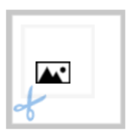

# Canvas



## Description

Favicon generate command.

Convert SVG Format File to ICO Format File.


 

[](https://github.com/prettier/prettier)
[](https://github.com/eslint/eslint)
[](https://github.com/facebook/jest?style=plastic)


 

## USAGE

Sorry, Not NPM Package.

After Command `npm run build`,  `node ./build/src/index.js path/to/SVG File Path`

```
exapmle

node ./build/src/index.js docs/input/clock.svg
```

- For Development

```
  npm run start docs/input/clock.svg

  npm run build ... Generate build JavaScript Source.

  npm run test ... Run Jest Test
```
## License

- [MIT](./LICENSE)

### Include Library License Explain.

- [sharp](https://github.com/lovell/sharp/blob/master/LICENSE)

- [Commander.js](https://github.com/tj/commander.js/blob/master/LICENSE)

### Author

- [Twitter](https://twitter.com/onesword0618)